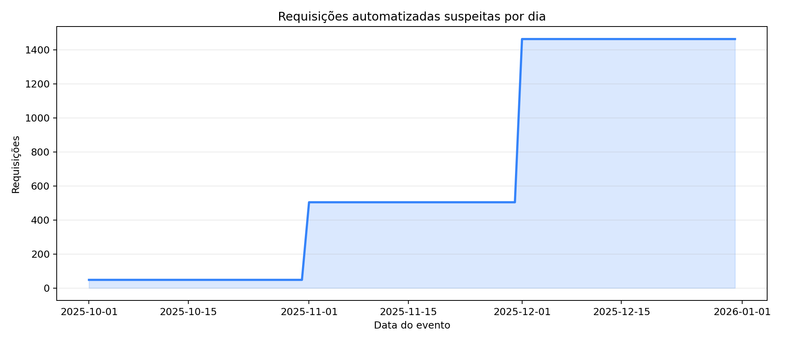

# Investigação forense - IDOR em invoices

Entrega completa e reproduzível para o caso de acesso indevido ao endpoint `/invoices/search`. O repositório combina preservação de evidência, análise em DuckDB/Python, notebook Jupyter, agente GenAI com verificação de evidências, resultados sanitizados e relatório formal.

## Decisão executiva

Os logs sustentam **alta confiança de exploração automatizada compatível com IDOR** e **confiança média de divulgação de PII**. Cinco origens exclusivamente automatizadas fizeram 61.961 requisições usando quatro tokens e consultaram 10.181 invoices distintos. Foram observadas 44.868 respostas HTTP 200 associadas a 10.173 invoices. Status 200 define uma população conservadora potencialmente exposta, mas não prova que o corpo da resposta continha PII.



## Entregas

- [Relatório forense formal](output/pdf/forensic_report.pdf) e [fonte auditável](reports/forensic_report.md).
- [Notebook reproduzível](notebooks/forensic_analysis.ipynb).
- [Pipeline forense](src/meli_forensics/pipeline.py) e CLI.
- [Agente GenAI reutilizável](src/meli_forensics/agent.py), com fallback determinístico e validação de citações.
- [Resultados públicos sanitizados](results/public/), incluindo top 20 IPs, países/ASNs, status por IP, top 10 tokens, sites e timeline.
- [Estratégia do caso](docs/forensic_strategy.md), [cadeia de custódia](docs/chain_of_custody.md) e [arquitetura](docs/architecture.md).
- Testes e CI em `.github/workflows/ci.yml`.

## Como reproduzir

```powershell
python -m venv .venv
.venv\Scripts\Activate.ps1
pip install -e .[dev]
python -m meli_forensics.cli --input C:\caminho\three_months_logs.zip
pytest -q
```

Também é possível definir `FORENSIC_INPUT` e executar o notebook. O pipeline aceita ZIP ou CSV, valida caminhos do arquivo compactado, calcula SHA-256, faz parsing explícito do timestamp `YYYY-DD-MMTHH:MM`, gera um banco DuckDB temporário e exporta resultados.

## Agente GenAI

Por padrão, o agente produz uma avaliação determinística e auditável:

```powershell
python -m meli_forensics.agent --results results/public
```

Para usar um provedor compatível com `/chat/completions`, configure `GENAI_API_KEY` e informe endpoint/modelo. Somente dados derivados e sanitizados são enviados; IPs completos, tokens brutos e logs não saem do ambiente.

```powershell
python -m meli_forensics.agent --results results/public `
  --llm-endpoint https://seu-provedor.example/v1/chat/completions `
  --model seu-modelo
```

## Proteção de dados

O repositório é público. Por isso, a evidência de 1,18 GB, IPs completos, tokens brutos, banco de trabalho e resultados restritos são ignorados pelo Git. A saída pública mascara o último octeto dos IPv4 e usa fingerprints SHA-256 estáveis. Os dados completos são gerados em `results/restricted/` apenas para o time autorizado, Legal e Privacy.

## Limite da conclusão

Os logs não contêm owner/account ID do invoice, subject do token, decisão de autorização, response body/bytes, request ID, timezone ou trilha de banco. Portanto, eles não permitem atribuição pessoal, prova definitiva de acesso cross-account ou confirmação isolada de PII entregue. Essas lacunas orientam as próximas requisições de evidência no relatório.
