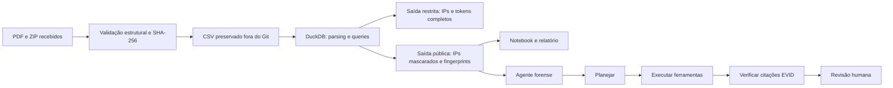

# Arquitetura da investigação e do agente

## Guardrails do agente

- Recebe somente resumo e resultados sanitizados.
- Trabalha com catálogo fechado de evidências `EVID-001` a `EVID-004`.
- Exige citação de evidência em toda saída GenAI.
- Se não houver modelo configurado, entrega avaliação determinística.
- Impede conclusão de atribuição ou PII confirmada baseada apenas em status HTTP.
- Nunca executa contenção, notificação ou alteração em sistemas; somente recomenda e exige revisão humana.

## Reutilização

O pipeline aceita qualquer CSV/ZIP com o mesmo schema. A regra de suspeição, queries e provider GenAI estão isolados. Para outro caso, ajuste o parser de URI, os limiares e o catálogo de evidências, mantendo a mesma sequência preservar -> analisar -> sanitizar -> raciocinar -> verificar.
